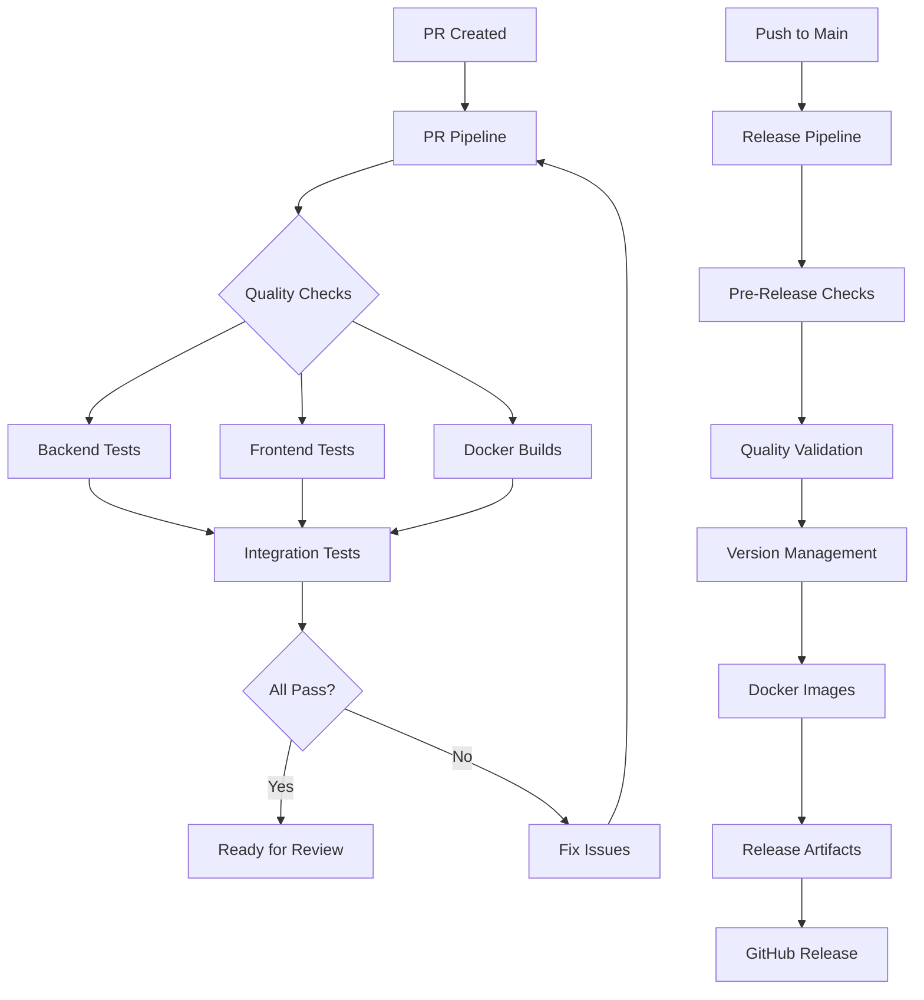

# 🚀 CI/CD Pipeline Documentation

This document describes the comprehensive CI/CD pipeline setup for the AI Research Assistant Platform.

---

## 📋 Overview

The project uses GitHub Actions for continuous integration and deployment with the following workflows:

1. **PR Pipeline** - Quality checks for pull requests
2. **Release Pipeline** - Automated releases and deployments
3. **Security Scan** - Weekly security vulnerability checks
4. **Dependency Update** - Automated dependency management

---

## 🔄 PR Pipeline (`pr-pipeline.yml`)

### **Purpose**
Runs comprehensive quality checks on every pull request to ensure code quality and prevent issues from reaching the main branch.

### **Triggers**
- Pull requests to `main` or `develop` branches
- Manual workflow dispatch

### **Jobs**

#### **Backend Quality Checks**
- **Linting**: Ruff for code style and formatting
- **Type Checking**: MyPy for static type analysis
- **Security Scan**: Bandit for security vulnerabilities
- **Tests**: Pytest with coverage across Python 3.9, 3.10, 3.11
- **Integration Tests**: Full-stack tests with Redis

#### **Frontend Quality Checks**
- **Linting**: ESLint for code quality
- **Tests**: Jest with coverage
- **Build**: Production build verification

#### **Docker Checks**
- **Image Building**: Backend, frontend, and Celery images
- **Compose Validation**: Docker Compose configuration validation

#### **Code Quality Metrics**
- **Complexity Analysis**: Radon for code complexity
- **TODO/FIXME Check**: Identifies incomplete code
- **Print Statement Check**: Ensures no debug prints in production

#### **Dependency Checks**
- **Outdated Dependencies**: Identifies packages that need updates
- **Security Vulnerabilities**: Safety checks for Python packages
- **Dependency Tree**: Visualizes package relationships

#### **Documentation Checks**
- **Required Files**: Validates essential documentation exists
- **Environment Files**: Ensures configuration examples are present

### **Artifacts**
- Coverage reports (HTML, XML)
- Security scan reports
- Build artifacts
- Test results

---

## 🚀 Release Pipeline (`release-pipeline.yml`)

### **Purpose**
Automatically creates releases when code is pushed to main or manually triggered, including version management, Docker images, and GitHub releases.

### **Triggers**
- Push to `main` branch
- Manual workflow dispatch with release type selection

### **Jobs**

#### **Pre-Release Checks**
- **Conventional Commits**: Analyzes commit messages for release type
- **Release Decision**: Determines if a release is needed
- **Version Bumping**: Automatically increments version numbers

#### **Quality Checks**
- **Backend Validation**: Linting, type checking, security, tests
- **Frontend Validation**: Linting, tests, build verification

#### **Version Management**
- **Semantic Versioning**: Automatically bumps version based on commit types
- **Release Notes**: Generates comprehensive release notes from commits
- **Version Updates**: Updates `pyproject.toml` and `package.json`

#### **Docker Images**
- **Multi-Architecture**: Builds for multiple platforms
- **Container Registry**: Pushes to GitHub Container Registry
- **Caching**: Optimized build caching for faster builds

#### **Release Artifacts**
- **Source Distribution**: Python package distribution
- **Wheel Distribution**: Binary package distribution
- **Release Archive**: Complete deployment package
- **Documentation**: Comprehensive release documentation

#### **GitHub Release**
- **Automatic Creation**: Creates GitHub release with artifacts
- **Release Notes**: Detailed changelog from conventional commits
- **Asset Upload**: Uploads all release artifacts

### **Release Types**
- **Patch**: Bug fixes and minor updates
- **Minor**: New features (backward compatible)
- **Major**: Breaking changes

---

## 🔒 Security Scan (`security-scan.yml`)

### **Purpose**
Weekly automated security scanning to identify vulnerabilities in dependencies and code.

### **Triggers**
- Weekly schedule (Monday 9 AM UTC)
- Manual workflow dispatch

### **Jobs**

#### **Security Vulnerability Scan**
- **Python Security**: Safety checks for Python dependencies
- **Code Security**: Bandit for code-level vulnerabilities
- **Pip Audit**: Comprehensive Python package audit
- **Node.js Security**: NPM audit for JavaScript dependencies

#### **Dependency Update Check**
- **Outdated Packages**: Identifies packages needing updates
- **Update Reports**: Generates detailed update recommendations

#### **Security Notification**
- **Summary Reports**: Creates comprehensive security summaries
- **Artifact Storage**: Stores all security reports for review

---

## 🔄 Dependency Update (`dependency-update.yml`)

### **Purpose**
Automatically creates pull requests for dependency updates and security fixes.

### **Triggers**
- Weekly schedule (Wednesday 10 AM UTC)
- Manual workflow dispatch

### **Jobs**

#### **Update Dependencies**
- **Python Updates**: Uses `uv` for dependency management
- **Node.js Updates**: Uses `npm update` for frontend dependencies
- **Automated PRs**: Creates pull requests for updates
- **Testing**: Ensures updates don't break functionality

#### **Security Updates**
- **Vulnerability Detection**: Identifies security issues
- **Auto-Fix**: Attempts to automatically fix vulnerabilities
- **Security PRs**: Creates high-priority security fix PRs

---

## 🛠️ Configuration

### **Environment Variables**

```yaml
env:
  PYTHON_VERSION: '3.11'
  NODE_VERSION: '18'
  REGISTRY: ghcr.io
  IMAGE_NAME: ${{ github.repository }}
```

### **Required Secrets**

```yaml
secrets:
  GITHUB_TOKEN: # Automatically provided by GitHub
  # Add any additional secrets as needed
```

### **Permissions**

```yaml
permissions:
  contents: write      # For releases and commits
  pull-requests: write # For creating PRs
  packages: write      # For Docker images
```

---

## 📊 Pipeline Metrics

### **Success Criteria**
- All tests pass
- Code coverage > 80%
- No security vulnerabilities
- No linting errors
- Type checking passes
- Docker builds successfully

### **Performance Targets**
- PR pipeline: < 15 minutes
- Release pipeline: < 30 minutes
- Security scan: < 10 minutes
- Dependency update: < 20 minutes

---

## 🔧 Local Development

### **Running Checks Locally**

```bash
# Backend checks
make lint
make type-check
make test
make security-check

# Frontend checks
cd frontend
npm run lint
npm test
npm run build

# Docker checks
docker-compose config
docker build -t ai-research-backend .
```

### **Pre-commit Hooks**

```bash
# Install pre-commit hooks
make pre-commit-install

# Run pre-commit on all files
make pre-commit-run
```

---

## 🚨 Troubleshooting

### **Common Issues**

#### **PR Pipeline Failures**
```bash
# Check linting issues
uv run ruff check . --output-format=github

# Fix formatting
uv run ruff format .

# Run tests locally
uv run pytest tests/ -v
```

#### **Release Pipeline Issues**
```bash
# Check version consistency
python -c "import toml; print(toml.load('pyproject.toml')['project']['version'])"
cat frontend/package.json | grep version

# Verify conventional commits
git log --oneline -10
```

#### **Docker Build Failures**
```bash
# Test Docker builds locally
docker build -t ai-research-backend .
docker build -t ai-research-frontend frontend/
docker build -f Dockerfile.celery -t ai-research-celery .
```

#### **Security Scan Issues**
```bash
# Run security checks locally
uv run safety check
uv run bandit -r app/
cd frontend && npm audit
```

### **Debugging Workflows**

1. **Check Workflow Logs**: View detailed logs in GitHub Actions
2. **Re-run Failed Jobs**: Use "Re-run jobs" feature
3. **Local Reproduction**: Run failing steps locally
4. **Artifact Inspection**: Download and examine artifacts

---

## 📈 Monitoring and Alerts

### **Success Metrics**
- Pipeline success rate > 95%
- Average build time < 20 minutes
- Security scan pass rate > 90%
- Dependency update frequency

### **Failure Alerts**
- Failed PR checks block merging
- Release failures trigger notifications
- Security vulnerabilities create high-priority PRs
- Dependency updates create automated PRs

---

## 🔄 Workflow Dependencies



---

## 📚 Best Practices

### **Commit Messages**
Use conventional commits for automatic versioning:
```bash
feat: add new research feature
fix: resolve authentication issue
docs: update API documentation
test: add integration tests
chore: update dependencies
```

### **Branch Strategy**
- `main`: Production-ready code
- `develop`: Development branch
- `feature/*`: Feature branches
- `deps/*`: Dependency updates
- `security/*`: Security fixes

### **Review Process**
1. All PRs require review
2. Automated checks must pass
3. Security issues block merging
4. Documentation updates required

---

## 🔗 Related Documentation

- [Contributing Guide](CONTRIBUTING.md)
- [Environment Setup](envs.md)
- [Local Development](local_model_setup.md)
- [Docker Setup](docker-compose.md)

---

## 📞 Support

For CI/CD issues:
1. Check workflow logs in GitHub Actions
2. Review this documentation
3. Create an issue with detailed error information
4. Include workflow run URL and error logs 